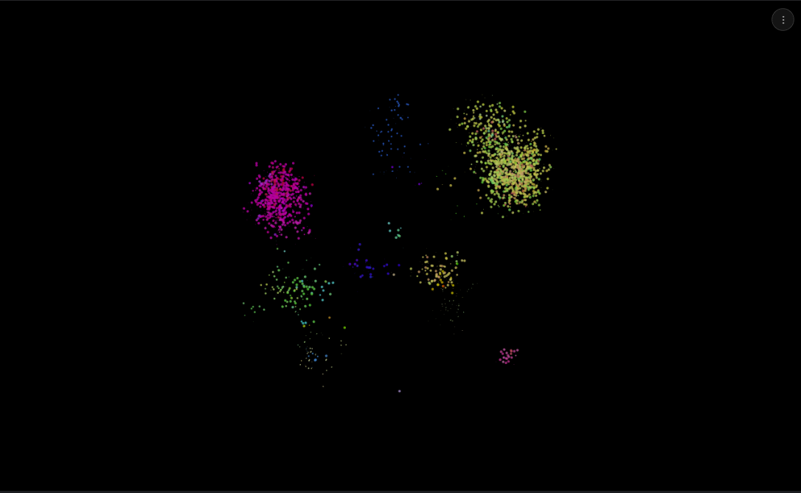

# Evolution Simulation

A beautiful and performant evolution simulation written in Rust, featuring an Entity Component System (ECS) with parallel processing, GPU-accelerated graphics (Desktop), and WebAssembly support.



## Quick Start

The easiest way to get started is using the provided npm scripts.

### Prerequisites

1. **Rust Nightly**: `rustup toolchain install nightly-2024-08-02`
2. **WASM Target**: `rustup target add wasm32-unknown-unknown`
3. **Node.js & npm**: [Install Node.js](https://nodejs.org/)

### Installation

```bash
# Install dependencies and set up environment
npm run setup
```

### Running the Project

**Desktop (GPU Accelerated):**
```bash
npm run dev:desktop
```

**Web (WebAssembly):**
```bash
npm run dev
# Then open http://localhost:8000
```
*Note: The web version requires a browser with `SharedArrayBuffer` support.*

## Deployment

Deploying to Cloudflare Pages is automated:

```bash
npm run deploy
```
For detailed instructions, see [docs/DEPLOYMENT.md](docs/DEPLOYMENT.md).

## Development

### Project Structure
```
evo/
├── src/
│   ├── components.rs       # ECS components
│   ├── genes/             # Genes module
│   ├── systems/           # Systems module (Movement, Interaction, etc.)
│   ├── simulation/        # Main simulation logic
│   └── ui/                # Desktop UI (WGPU)
├── web/                   # Web frontend assets
└── scripts/               # Build/setup scripts
```

### Key Commands

| Command | Description |
|---------|-------------|
| `npm run dev:desktop` | Run desktop app with graphics |
| `npm run dev:desktop:headless` | Run desktop app without graphics (fast testing) |
| `cargo test` | Run Rust unit tests |
| `cargo clippy` | Run linter |
| `npm run build:web` | Compile to WASM |

## Simulation Details

For a deep dive into the genetic algorithms, movement logic, and system architecture, see [docs/SIMULATION_SYSTEM.md](docs/SIMULATION_SYSTEM.md).

## License

MIT License. See [LICENSE](LICENSE) for details. (If no license file is present, assume standard MIT).
