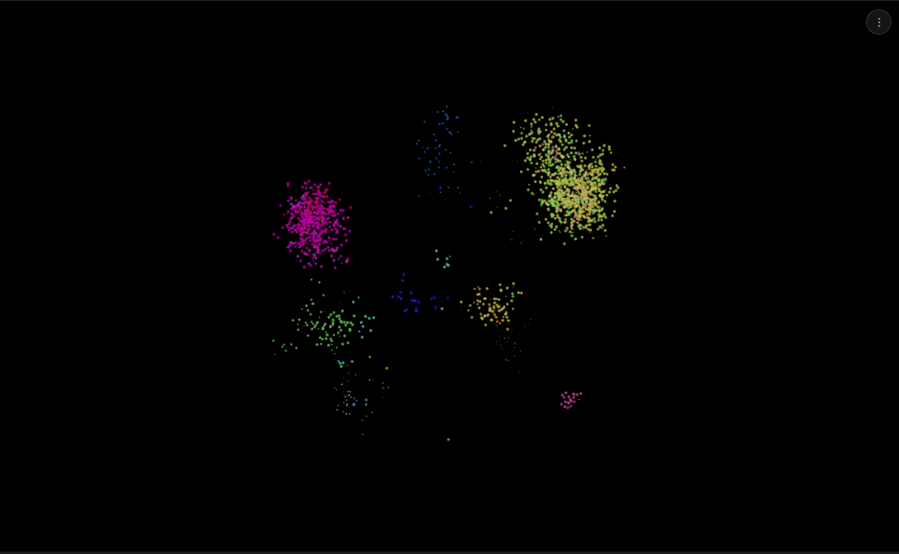

# Evolution Simulation

A beautiful and performant evolution simulation written in Rust with WebGPU-accelerated graphics and WebAssembly, running entirely in the browser.

**Live:** [evo.tre.systems](https://evo.tre.systems) — needs a WebGPU-capable browser (Chrome / Edge / Brave 113+). It starts from a curated default seed; clear the seed box for a random run, or enter a seed to reproduce or share one (the seed is shown in the UI and logged to the console).



## Quick Start

### Prerequisites

1. **Rust Nightly**: `rustup toolchain install nightly-2024-08-02`
2. **WASM Target**: `rustup target add wasm32-unknown-unknown`
3. **Node.js & npm**: [Install Node.js](https://nodejs.org/)
4. **WebGPU-capable browser**: Chromium-based (Chrome / Edge / Brave) 113+

### Installation

```bash
# Install dependencies and set up environment
npm run setup
```

### Running

```bash
npm run dev
# Then open http://localhost:8788
```

## Deployment

Deploy to Cloudflare Pages:

```bash
npm run deploy
```

For detailed instructions, see [docs/DEPLOYMENT.md](docs/DEPLOYMENT.md).

## Development

### Project Structure

See the [repo layout](docs/ARCHITECTURE.md#repo-layout) and [code map](AGENTS.md#code-map) — kept in one place so they can't drift.

### Key Commands

| Command | Description |
|---------|-------------|
| `npm run dev` | Start local dev server |
| `npm run build` | Compile to WASM |
| `npm run deploy` | Build and deploy to Cloudflare Pages |
| `cargo test` | Run Rust tests |
| `cargo clippy` | Run linter |

## Documentation

- [Architecture](docs/ARCHITECTURE.md) — how the code is organized and how a frame is produced
- [Diagrams](docs/diagrams/README.md) — Graphviz architecture diagrams (system overview, simulation tick)
- [Simulation System](docs/SIMULATION_SYSTEM.md) — genes, movement styles, predation, and statistics
- [Deployment](docs/DEPLOYMENT.md) — Cloudflare Pages and the SharedArrayBuffer header requirement
- [Backlog](BACKLOG.md) — ordered next work and known constraints
- [Agent Notes](AGENTS.md) — workflow, verification, and architecture rules for agents

## License

MIT License.
