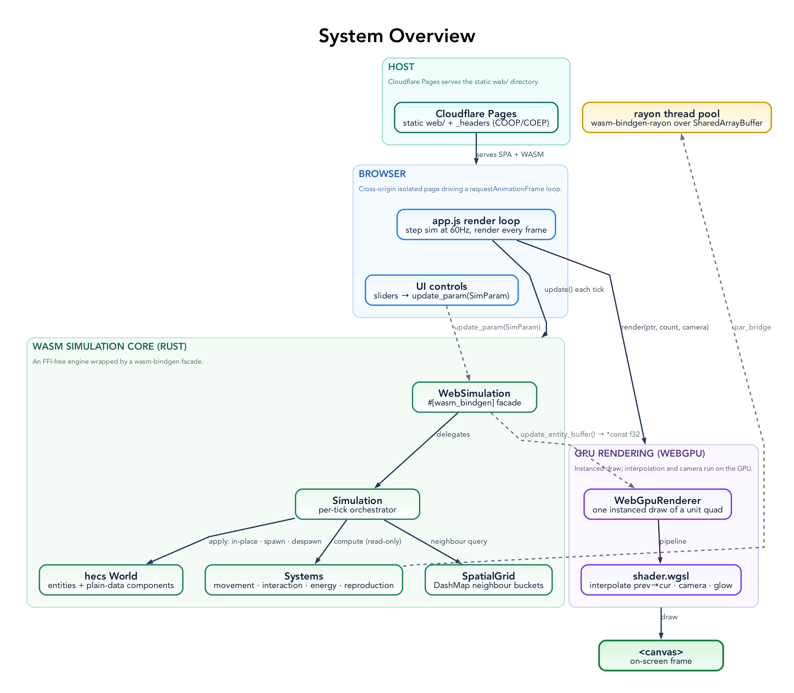
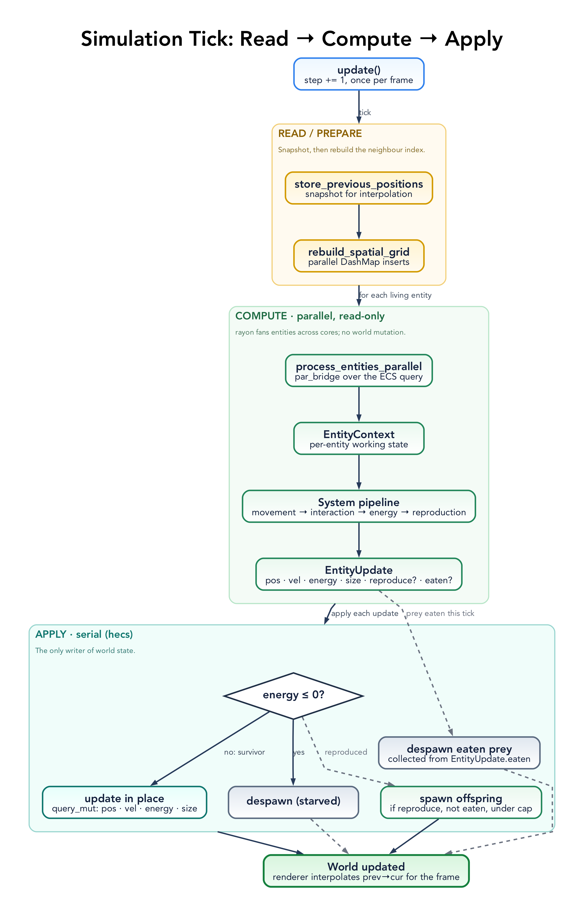

# Evolution Simulation — Architecture

> Scope: how the code is organized and how one rendered frame is produced. For the simulation *mechanics* — genes, movement styles, predation, statistics — see [SIMULATION_SYSTEM.md](SIMULATION_SYSTEM.md).



## Stack

| Layer | Choice | Notes |
|-------|--------|-------|
| Language | Rust (edition 2021) | ~5,500 lines across `src/` |
| ECS | `hecs` 0.9 | Lightweight archetypal ECS; systems are hand-orchestrated (no scheduler) |
| Parallelism | `rayon` | Parallel per-entity processing over ECS queries |
| Concurrency | `dashmap` | Backs the spatial grid for concurrent neighbour inserts |
| Rendering | `wgpu` 24 (WebGPU) | Instanced quads with a glow shader |
| In-browser threads | `wasm-bindgen-rayon` + `SharedArrayBuffer` | Requires cross-origin-isolation headers |
| Toolchain | nightly-2024-08-02 | Needed for `-Z build-std` (atomics-enabled `std` for WASM threads) |
| Host | Cloudflare Pages | Static `web/` directory served with `_headers` |

The toolchain is pinned because atomics + `build-std` are nightly-only. This pin is the project's main maintenance constraint — see [BACKLOG.md](../BACKLOG.md).

## Repo Layout

```
src/
├── lib.rs              # WASM entry: WebSimulation (#[wasm_bindgen]) wraps the sim for JS
├── config/             # SimulationConfig — all tunable parameters (serde, hot-swappable)
├── components.rs       # ECS components: Position, Velocity, Energy, Size, Color, MovementStyle
├── genes/              # Genetic model: generation, mutation, similarity, particle-life weights
├── simulation/         # Per-tick orchestrator (the read → compute → apply loop)
├── spatial_grid.rs     # DashMap-backed spatial hash for neighbour queries
├── systems/            # movement/, interaction/ (predation), energy, reproduction
├── stats/              # Population statistics, serialized to JS
├── web/                # WebGPU renderer (wasm32-only)
└── shader.wgsl         # Vertex (interpolation + camera) + fragment (glow) shaders
web/                    # Static frontend (index.html, js/app.js, _headers) — the deploy root
scripts/                # build-web.sh (wasm-pack + cache-busting), setup.sh
```

## Patterns

The simulation is built from a small set of recurring patterns. Naming them once is the fastest way to read any individual file — every system, component, and data path is an instance of one of these. The sections after this one show the load-bearing ones in detail.

**Entity-Component-System (ECS).** State lives in a `hecs::World` as entities composed of plain-data components (`Position`, `Velocity`, `Energy`, `Size`, `Color`, `Genes`, `MovementStyle` — in `components.rs` and `genes/`). Components carry no behaviour; behaviour lives in systems. There is no scheduler — the orchestrator calls systems by hand.

**Stateless system-as-unit-struct.** Each system is a zero-sized unit struct (`MovementSystem`, `InteractionSystem`, `EnergySystem`, `ReproductionSystem` in `systems/`), held as a field on `Simulation` and instantiated once. Systems hold no state; they are namespaces for behaviour that takes the world and components as arguments.

**Read–Compute–Apply (deferred mutation).** The cardinal tick pattern. Each step: (1) **read** the world through immutable queries, (2) **compute** a `Vec<EntityUpdate>` in parallel under rayon — pure functions of the read state, no world mutation, and (3) **apply** the results serially in the orchestrator — writing each survivor's components in place, despawning the dead and any eaten prey, and spawning offspring. The invariant: *no system mutates `World` structure from inside a parallel query.* The one deliberate exception is the spatial-grid rebuild, which writes into a `DashMap` from a parallel iterator — sound precisely because the target is a thread-safe concurrent map, not the `World`.

**Command object (`EntityUpdate`).** The carrier between compute and apply (`simulation/mod.rs`). Every per-entity result — new position/velocity/energy/size, whether it reproduced, and any prey it ate — is packaged into one `EntityUpdate`, and the apply phase is its sole interpreter. This is what lets the compute phase stay pure and parallel.

**Spatial hashing for neighbour queries.** `SpatialGrid` (`spatial_grid.rs`) buckets entities into fixed-size cells in a `DashMap`. A neighbour lookup scans only the cells within the query radius — never the whole population — turning O(N²) all-pairs into near-O(N). The grid is queried once per entity per tick and the result is shared by movement and interaction. Two deliberate refinements: cell order is shuffled per query to remove directional bias, and each entity considers at most 20 neighbours (`take(20)`), trading completeness for a bounded per-entity cost.

**System pipeline over a shared context.** All four systems implement one trait — `System::run(&mut EntityContext)` (`systems/`) — and the orchestrator runs them in a fixed order (movement → interaction → energy → reproduction) over a single `EntityContext` carrying the read-only inputs and the mutable `new_*` working state. The per-system `*Params` structs (`MovementUpdateParams`, `InteractionParams`) and the orchestrator's `ProcessEntityParams` are the parameter-object form used to pass many borrows without long argument lists.

**Centralized archetype.** The creature component bundle is built in one place, `systems::creature_bundle`, used by both the initial spawn and reproduction so the archetype cannot drift between the two.

**Grouped configuration.** `SimulationConfig` is a struct of domain sub-structs (`population`, `physics`, `energy`, `reproduction` — `config/mod.rs`), serde-(de)serializable, with a `Default`. It is threaded read-only as `&config` to every system, and individual fields are tunable live through `WebSimulation::update_param` via a typed `SimParam` enum. `Genes` mirrors this shape with one sub-struct per trait domain.

**Phenotype from genotype (derived data).** Visible and effective traits are computed from genes, never stored independently: `Color` via `Genes::get_color()` (HSV→RGB), edibility via `can_eat()`, prey choice via `get_predation_preference()`, plus flat accessor shims (`speed()`, `sense_radius()`, …) over the nested gene structs. Genes are the single source of truth; phenotype is a pure function of them.

**FFI boundary facade.** `WebSimulation` and `WebGpuRenderer` (`lib.rs`, `web/webgpu.rs`) are the only `#[wasm_bindgen]` types. They own all JS-facing marshalling and delegate to an FFI-free core (`Simulation` returns plain Rust tuples). The boundary is the one place `Result<_, JsValue>` and raw pointers appear.

**Zero-copy render buffer.** Instead of per-creature draw calls, entities are packed into one flat `[f32]` (8 floats each) exposed to JS by raw pointer; the renderer reads it as instance data for a single instanced draw, and the shader does interpolation and the camera transform on the GPU (see Rendering Pipeline).

**Snapshot for interpolation.** Each tick snapshots positions into `previous_positions` (keyed by entity) before moving entities, so the renderer can interpolate between the last two sim states — decoupling visual smoothness from tick rate. Because entities are updated in place, their ids are stable across ticks, so the snapshot matches the live entities and the interpolation is active.

**Graceful-skip error handling.** Component reads in the hot path use `if let Ok(...)` and silently skip entities that vanished mid-tick; despawns discard their `Result` (`let _ =`); the FFI boundary uses `Result`/`map_err`; other fallbacks use `unwrap_or(default)`. There are no `panic!`/`unwrap`/`expect` in non-test code.

Known consistency gaps and patterns under consideration are tracked in [BACKLOG.md](../BACKLOG.md).

## Simulation Tick



`Simulation::update()` ([src/simulation/mod.rs](../src/simulation/mod.rs)) runs each step in three phases:

1. **Snapshot** — store previous positions (used for GPU-side interpolation between sim steps).
2. **Build spatial grid** — rebuild the `SpatialGrid` from current positions (concurrent inserts via DashMap).
3. **Compute then apply** — process every entity *in parallel* into a list of `EntityUpdate`s, then apply that list *serially*: write each survivor's `Position`/`Velocity`/`Energy`/`Size` in place (via `query_mut`), despawn the starved/dead and any eaten prey, and spawn offspring.

This split exists because hecs mutation (in-place writes and spawn/despawn) is single-threaded. Reads and per-entity math fan out across cores; only the apply step mutates the world.

## Parallelism Model

Per-entity work (movement forces, predation targets, metabolism) is read-only against the world and runs under `rayon`. Each worker produces an `EntityUpdate` rather than mutating shared state; the serial apply step is the only writer. The cardinal rule: **never spawn/despawn or mutate the world from inside a parallel query.**

## Spatial Grid

`src/spatial_grid.rs` partitions the world into a grid of cells and stores entity handles per cell in a `DashMap`. A neighbour query returns candidates from the cell containing an entity plus its surrounding cells, turning the O(N²) all-pairs scan into a near-O(N) local scan. Concurrent inserts during the build phase are why the map is a `DashMap`.

## Rendering Pipeline

The CPU never builds vertex geometry per entity. Instead:

1. `WebSimulation::update_entity_buffer()` ([src/lib.rs](../src/lib.rs)) flattens every entity into a packed `f32` buffer — **8 floats each**: `prev_x, prev_y, x, y, radius, r, g, b` — and returns a raw pointer into WASM linear memory (zero-copy).
2. `entity_count()` returns `buffer.len() / 8`.
3. The renderer ([src/web/webgpu.rs](../src/web/webgpu.rs)) reads that slice, builds one 32-byte `Instance` per entity, and issues a single instanced draw of a unit quad.
4. `shader.wgsl` does the heavy lifting on the GPU: it interpolates between `prev` and current position for smooth motion between sim steps, applies the world→screen + camera (zoom/pan) transform, and draws a multi-layer glow in the fragment stage.

## Threading & WASM

In-browser multithreading needs `SharedArrayBuffer`, which browsers only expose in cross-origin-isolated contexts. That requires two response headers (set in `web/_headers`):

```
Cross-Origin-Opener-Policy: same-origin
Cross-Origin-Embedder-Policy: require-corp
```

The thread pool is initialised from JS via `wasm-bindgen-rayon`. The atomics-enabled `std` is built from source (`-Z build-std`), which is why the toolchain is pinned to a specific nightly with `rust-src`.

## Build & Deploy

- `npm run build` → `scripts/build-web.sh`: `wasm-pack build --target web` with `CARGO_UNSTABLE_BUILD_STD=std,panic_abort`, then injects a git-SHA `?v=` cache-busting query into the generated JS/HTML and copies `pkg/` → `web/pkg/`.
- `npm run dev` → `wrangler pages dev web` (serves `web/`, honours `_headers`, port 8788).
- `npm run deploy` → build, then `wrangler pages deploy web --project-name evo`.
- CI (`.github/workflows/ci-cd.yml`) runs the verification gate on every push/PR and deploys to Cloudflare Pages on push to `main`.

`pkg/` and `web/pkg/` are generated and git-ignored. There is no `wrangler.toml`; the Pages project name lives only in the deploy command.

## What This Architecture Deliberately Does Not Include

- **No server or persistence.** Everything runs client-side; there is no backend, database, or save/load.
- **No GPU compute for the simulation.** Neighbour search and physics are CPU + rayon; only rendering uses the GPU. (GPU-side spatial processing is a backlog idea, not current behaviour.)
- **No practical WebGL fallback.** The `wgpu` `webgl` feature is enabled, but the renderer targets WebGPU; non-WebGPU browsers are unsupported.
- **A practical instance ceiling.** The renderer pre-allocates for ~20,000 instances; scaling to 100K–1M is exploratory (see BACKLOG).
- **No size-optimised WASM.** `wasm-opt` is disabled, favouring build simplicity over bundle size.
