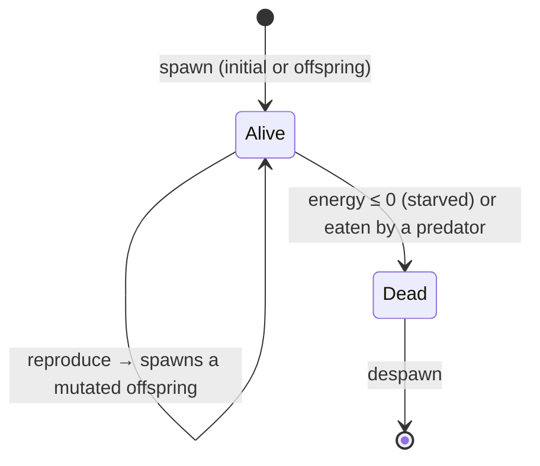

# Simulation Mechanics

How the creatures behave: genes, movement, predation, the energy economy, and statistics. For *how the code is organized* — the ECS, the tick pipeline, the renderer — see [ARCHITECTURE.md](ARCHITECTURE.md).

## Entity Lifecycle

Every creature follows the same lifecycle — born from the initial population or as a mutated offspring, updated each tick, and removed when it starves or is eaten:

For the per-tick machinery behind these transitions, see the [simulation tick diagram](diagrams/simulation-tick.png).

## Genetic System

Genes determine all behaviour and appearance. They are mutable and heritable: an offspring inherits its parent's genes with small per-trait mutations. `Color` and effective traits are *derived* from genes rather than stored separately, so genes are the single source of truth.

| Category | Traits |
|----------|--------|
| **Movement** | `speed`, `sense_radius` |
| **Energy** | `efficiency`, `loss_rate`, `gain_rate`, `size_factor` |
| **Reproduction** | `rate`, `mutation_rate` |
| **Appearance** | `hue`, `saturation` |
| **Behaviour** | `movement_style`, `social_tendency`, `gene_preference_strength` |

Genetic *similarity* between two creatures — a weighted distance over these traits — drives predation preference and flocking cohesion.

## Movement

Entities exhibit one of five genetically determined movement styles:

1. **Random** — baseline brownian-like motion.
2. **Flocking** — cohesion, alignment, and separation (boids) with genetically similar neighbours.
3. **Solitary** — active avoidance of other entities.
4. **Predatory** — pursuit of prey based on genetic preference and size advantage.
5. **Grazing** — slow, steady motion with minimal energy expenditure.

On top of the chosen style, a **global particle-life interaction matrix** — generated from the seed and indexed by *both* creatures' hue sectors — applies an attraction/repulsion force during the same neighbour pass. Because every creature of a given hue reacts to each other hue the *same* way, colour groups attract and repel coherently: clusters form, move as units, and collide instead of dissolving into a uniform haze. Each seed yields a different matrix — a different "physics" — tunable live via `particle_force_scale` (with `particle_friction`).

All these forces — style, flocking, particle-life, and edge repulsion — accumulate into one velocity that is then **capped at `max_velocity`** (by magnitude) each tick, so no combination can exceed the speed limit.

**Edge repulsion.** Each window edge pushes creatures back perpendicular to itself, ramping up quadratically as they approach, so the interior is free to roam and the population stays off the edges (rather than a constant centre-pull that would collapse everything into one blob). Strength is tunable via `center_pressure_strength`.

## Interaction & Energy

- **Predation** — larger, faster creatures eat smaller specific prey, and predators prefer genetically *distinct* prey (`gene_preference_strength`), which promotes diversity. Eating transfers the prey's energy and despawns it.
- **Energy economy** — movement and existence cost energy; predation transfers it between creatures. The only *input* is **primary production**: every creature grazes a little energy from an ambient food field each tick (`ambient_energy_gain`), scaled by `(1 − population_density)` so the field is finite. That finite input gives the ecosystem a **carrying capacity** — the population settles where production balances metabolism instead of decaying to a few survivors.
- **Local-crowding reproduction** — a creature with enough energy reproduces, but the chance is throttled by *local* crowding (neighbours within sense range), not the global count. A lineage that reaches an open patch reproduces freely and blooms into it as a spreading patch of its inherited colour, while crowded areas stall. Death, by contrast, scales with *global* density — a system-wide culling pressure.

## Neighbour Queries

Movement and interaction both need each creature's nearby neighbours. These come from a spatial grid plus a per-tick neighbour cache — see the Patterns section of [ARCHITECTURE.md](ARCHITECTURE.md) for the mechanism and its determinism guarantees.

## Statistics

Each `get_stats()` reports the population count, a per-colour classification, average genetic metrics (speed, size, efficiency, reproduction rate, sense radius), population density, and world-centre drift — serialized to JS for the on-page stats and console logging.
