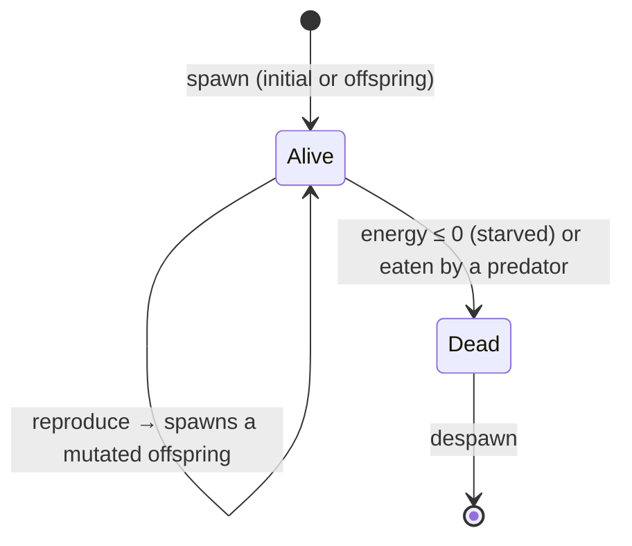

# Simulation Mechanics

How the creatures behave: genes, movement, predation, the energy economy, and statistics. For *how the code is organized* — the ECS, the tick pipeline, the renderer — see [ARCHITECTURE.md](ARCHITECTURE.md).

## Entity Lifecycle

Every creature follows the same lifecycle — born from the initial population or as a mutated offspring, updated each tick, and removed when it starves or is eaten:

For the per-tick machinery behind these transitions, see the [simulation tick diagram](diagrams/simulation-tick.png).

## Genetic System

Genes determine all behaviour and appearance. They are mutable and heritable: an offspring inherits its parent's genes with small per-trait mutations. `Color` and effective traits are *derived* from genes rather than stored separately, so genes are the single source of truth.

| Category | Traits |
|----------|--------|
| **Movement** | `speed`, `sense_radius` |
| **Energy** | `efficiency`, `loss_rate`, `gain_rate`, `size_factor` |
| **Reproduction** | `rate`, `mutation_rate` |
| **Appearance** | `hue`, `saturation` |
| **Behaviour** | `movement_style`, `social_tendency`, `gene_preference_strength` |

Genetic *similarity* between two creatures — a weighted distance over these traits — drives predation preference and flocking cohesion.

**Speciation.** Distinct coloured lineages emerge, persist, and compete rather than blurring into a uniform rainbow. Two mechanisms produce this:

- **Assortative hue inheritance** (`Genes::mutate`) — an offspring's hue normally drifts only a *tiny* amount from its parent's, so a lineage reads as a coherent colour cluster; a rare large jump founds a brand-new colour lineage (a new "species").
- **Negative frequency-dependent reproduction** (`src/systems/reproduction`) — a creature ringed by neighbours of its *own* hue is throttled harder (its colour's local niche is saturated), while a rare colour breeds freely (`hue_crowding_factor`). No single hue can take the whole world, so several lineages coexist and trade dominance over time.

Together with the coherent clustering from the particle-life matrix, these make the population resolve into several persistent colour territories that wax and wane. See the asserting test `test_speciation_multiple_persistent_hues`.

## Movement

Entities exhibit one of five genetically determined movement styles:

1. **Random** — baseline brownian-like motion.
2. **Flocking** — cohesion, alignment, and separation (boids) with genetically similar neighbours.
3. **Solitary** — active avoidance of other entities.
4. **Predatory** — pursuit of prey based on genetic preference and size advantage.
5. **Grazing** — slow, steady motion with minimal energy expenditure.

On top of the chosen style, a **global particle-life interaction matrix** — generated from the seed and indexed by *both* creatures' hue sectors — applies an attraction/repulsion force during the same neighbour pass. Because every creature of a given hue reacts to each other hue the *same* way, colour groups attract and repel coherently: clusters form, move as units, and collide instead of dissolving into a uniform haze. Each seed yields a different matrix — a different "physics" — tunable live via `particle_force_scale` (with `particle_friction`).

Creatures also feel a gentle **food-seeking** force, drifting up the local food gradient toward the drifting food patches (see *Food field* below) so they migrate to and gather at nourishment. Genes modulate it: grazers seek hardest, predators barely (they hunt prey, not patches), and a higher food-`gain_rate` gene sharpens the appetite. It is kept soft so it *structures* the motion — lovely flowing aggregations at food — without overpowering the particle-life and flocking emergence.

All these forces — style, flocking, particle-life, food-seeking, and edge repulsion — accumulate into one velocity that is then **capped at `max_velocity`** (by magnitude) each tick, so no combination can exceed the speed limit.

**Edge repulsion.** Each window edge pushes creatures back perpendicular to itself, ramping up quadratically as they approach, so the interior is free to roam and the population stays off the edges (rather than a constant centre-pull that would collapse everything into one blob). Strength is tunable via `center_pressure_strength`.

## Interaction & Energy

- **Predation** — larger, faster creatures eat smaller specific prey, and predators prefer genetically *distinct* prey (`gene_preference_strength`), which promotes diversity. Eating transfers the prey's energy and despawns it. Creatures with the **Predatory** movement style are carnivore-specialists: they graze only a fraction of the food field (`predator_graze_fraction`), so they live mostly off prey and **starve once they have eaten the prey down** — the decoupling that makes predator and prey numbers cycle.
- **Energy economy** — movement and existence cost energy; predation transfers it between creatures. The only *input* is **primary production**: each creature grazes energy from the food field at its position each tick, scaled by `(1 − population_density)` so the field is finite. That finite input gives the ecosystem a **carrying capacity** — the population settles where production balances metabolism instead of decaying to a few survivors.
- **Local-crowding reproduction** — a creature with enough energy reproduces, but the chance is throttled by *local* crowding (neighbours within sense range), not the global count. A lineage that reaches an open patch reproduces freely and blooms into it as a spreading patch of its inherited colour, while crowded areas stall.

## Population Dynamics — Boom/Bust

The ecosystem does not sit at a flat equilibrium; total and predator/prey numbers rise and fall in visible **boom/bust waves**, kept strictly bounded between the carrying-capacity ceiling and a hard safety floor. Two coupled mechanisms drive the cycle (the pressure reservoir is advanced each tick in `src/simulation`, the death decision lives in `src/systems/reproduction`):

- **Lagged density-dependent mortality (the oscillator).** Death scales not with the *instantaneous* population density but with a slow low-pass of it — a **crowding pressure** reservoir (`Simulation::crowding_pressure`) that relaxes toward the live density at `crowding_pressure_rate` each tick. Because mortality *lags* the population, the crowd overshoots its carrying capacity before deaths catch up, then the accumulated pressure pulls it back under, and the cycle repeats. Predator booms (predators thriving on abundant prey, then starving) ride on top of this, sharpening the swings.
- **The death-floor gate (the safety bound).** Density-dependent death is switched off entirely once the *live* density falls to `death_floor_density`, ramping back in smoothly above it. So a deep bust dives **toward** the floor for drama but mortality can never push the population **through** it — combined with the inexhaustible base of the food field (which keeps prey fed), this makes extinction impossible regardless of how hard the lag is tuned. The cap caps the top; the floor gate caps the bottom.

This is delayed density dependence — the classic source of limit cycles in population models — fenced between two hard bounds. See the asserting tests `test_population_stays_in_safe_band_long_run`, `test_population_oscillates`, and `test_death_floor_blocks_extinction`.

## Food Field

Primary production is **not uniform**. It is split into a thin uniform **base** everywhere plus a handful of drifting **food patches** (`src/simulation/food.rs`), so the world grows *places worth moving to* rather than a flat glow. Each patch has a position, falloff radius, and intensity; patches wander slowly, regrow toward their capacity in place, and **deplete** as creatures graze them (bounded by a floor so a crowded patch dips but never fully vanishes, keeping a gradient to gather on). A creature's grazing gain is the base plus each nearby patch's contribution, falling off smoothly to zero at its radius.

The split is balanced so the *world-average* production matches the old uniform field — the carrying capacity is preserved, the food is merely **concentrated in space**. The base keeps between-patch creatures alive (so the population is stable across seeds), while the patches plus the food-seeking force make creatures visibly migrate to and aggregate at the brighter cores. The whole field is deterministic in `(seed, step)` — updated once per tick in the serial phase, then read immutably by the parallel per-entity compute — so a run still reproduces bit-for-bit. The live "Food" slider (`ambient_energy_gain`) scales the whole field; patch count, radius, drift, regrowth, and the seek strength live under the `food` config group. The renderer draws the patches as dim, soft teal blobs into the HDR scene *before* the creatures, so the viewer reads the food structure as ambient nourishment without it competing with the bloom.

## Neighbour Queries

Movement and interaction both need each creature's nearby neighbours. These come from a spatial grid plus a per-tick neighbour cache — see the Patterns section of [ARCHITECTURE.md](ARCHITECTURE.md) for the mechanism and its determinism guarantees.

## Statistics

Each `get_stats()` reports the population count, a per-colour classification, average genetic metrics (speed, size, efficiency, reproduction rate, sense radius), population density, and world-centre drift — serialized to JS for the on-page stats and console logging.
