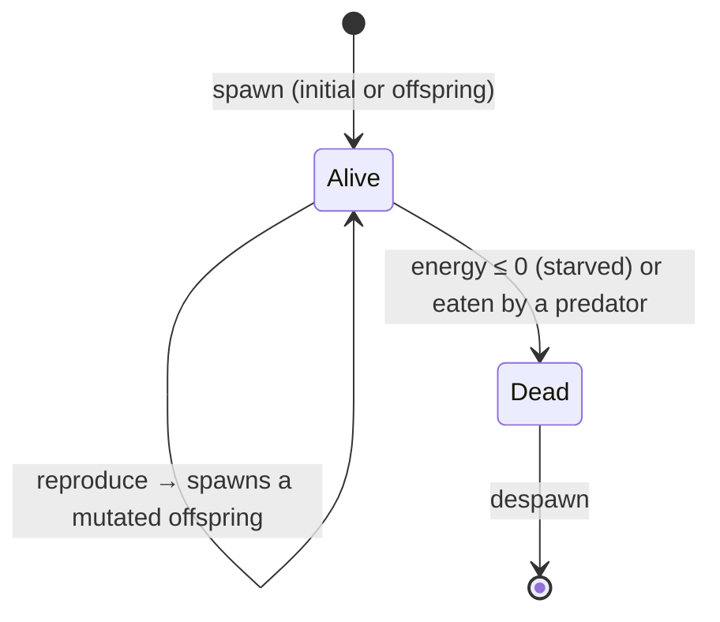

# Evolution Simulation System Documentation

## Overview

The Evolution Simulation is a complex ecosystem simulation built in Rust using an Entity-Component-System (ECS) architecture. It simulates the evolution of entities through natural selection, genetic inheritance, and environmental pressures.

## Entity Lifecycle

Every creature follows the same lifecycle — born from the initial population or as a mutated offspring, updated each tick, and removed when it starves or is eaten:

For the per-tick machinery behind these transitions, see the [simulation tick diagram](diagrams/simulation-tick.png) and [ARCHITECTURE.md](ARCHITECTURE.md).

## Core Architecture

### Technology Stack

- **Language**: Rust
- **ECS Framework**: Hecs
- **Parallelism**: Rayon
- **Rendering**: WGPU (Desktop) / WebGL/WGPU (Web via wgpu)
- **Serialization**: Serde

### Design Principles

- **Modularity**: Systems (Movement, Interaction, Energy, Reproduction) are independent.
- **Parallel processing**: Heavy computations use `rayon` for multi-core scaling.
- **Configurability**: Simulation parameters are hot-swappable via JSON.

## System Components

### 1. Entity Components

Core data structures managed by the ECS:
- **Position & Velocity**: 2D Physics vectors.
- **Energy**: Life force; entities die at 0 energy.
- **Size**: Radius affecting energy cost and interaction range.
- **Color**: Visual phenotype derived from genes.
- **Genes**: The genetic blueprint (see below).

### 2. Genetic System

Genes determine all behavior and attributes. They are mutable and heritable.

| Category | Traits |
|----------|--------|
| **Movement** | `speed`, `sense_radius` |
| **Energy** | `efficiency`, `loss_rate`, `gain_rate`, `size_factor` |
| **Reproduction** | `rate`, `mutation_rate` |
| **Shape/Color** | `hue`, `saturation` |
| **Behavior** | `movement_style`, `social_tendency`, `gene_preference` |
| **Particle Life** | `interactions` — per-creature weights feeding genetic distance (the force itself uses a global, seed-derived matrix) |

### 3. Movement System

Entities exhibit one of five genetically determined movement styles:
1. **Random**: Baseline brownian-like motion.
2. **Flocking**: Cohesion, alignment, and separation (Boids algorithm) with genetically similar neighbors.
3. **Solitary**: Active avoidance of other entities.
4. **Predatory**: Active pursuit of prey based on genetic preference and size advantage.
5. **Grazing**: Slow, steady movement with minimal energy expenditure.

On top of these styles, a **global particle-life interaction matrix** — generated from the seed and indexed by *both* creatures' hue sectors — applies an attraction/repulsion force during the same single neighbour pass. Because every creature of a given hue reacts to each other hue the *same* way, colour groups coherently attract and repel: clusters form, move as units, and collide, instead of dissolving into a uniform haze. Each seed yields a different matrix — a different "physics" — and the strength is tunable live via `particle_force_scale` (with `particle_friction`).

All of these forces — style behaviour, flocking, particle-life, and center pressure — accumulate into a single velocity that is then **capped at `max_velocity`** (by magnitude) each tick, so no combination of forces can push a creature past the speed limit.

### 4. Interaction System

- **Predation**: Larger entities eat smaller specific prey.
- **Gene Preference**: Predators prefer genetically distinct prey (promoting diversity).
- **Energy economy**: Movement and existence consume energy; predation transfers it between creatures. The only *input* is **primary production** — every creature draws a little energy from an ambient food field each tick (`energy.ambient_energy_gain`), scaled by `(1 - population_density)` so the field is finite. That finite input gives the ecosystem a **carrying capacity**: the population settles around the density where production balances metabolism, instead of decaying to a few survivors the way a closed, input-free system does. Reproduction itself is gated by **local crowding** (neighbours within sense range), not the global count — so a lineage that reaches an open patch reproduces freely and blooms into it as a spreading patch of its inherited colour, while crowded areas stall. Mutant colour variants bloom the same way, so populations rise and spread in visible waves rather than sitting at a flat, uniform equilibrium.

### 5. Spatial System

- **Spatial Grid**: The world is partitioned into cells to optimize neighbor lookups (O(1) instead of O(N²)).
- **Boundaries**: Edge repulsion — each edge pushes organisms back perpendicular to itself, ramping up quadratically as they approach, so the interior is free to roam and organisms are kept off the edges (rather than a constant pull toward the centre that would collapse everything into one blob).

## Statistics

Real-time metrics tracking:
- Population counts by species/behavior.
- Average genetic drift (evolution speed).
- System performance (FPS, step time).

## Roadmap & Future Ideas

- **Environmental Complexity**: Terrain, obstacles, and localized resource patches.
- **Advanced Biology**: Aging, disease/parasites, and sexual dimorphism.
- **Complex Sociality**: Mating rituals, territorial defense, and memory/learning.
- **Multi-Species**: Symbiotic relationships and food webs.
